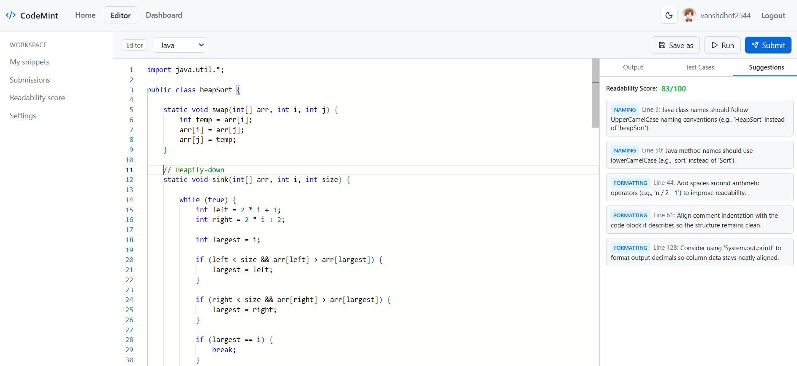
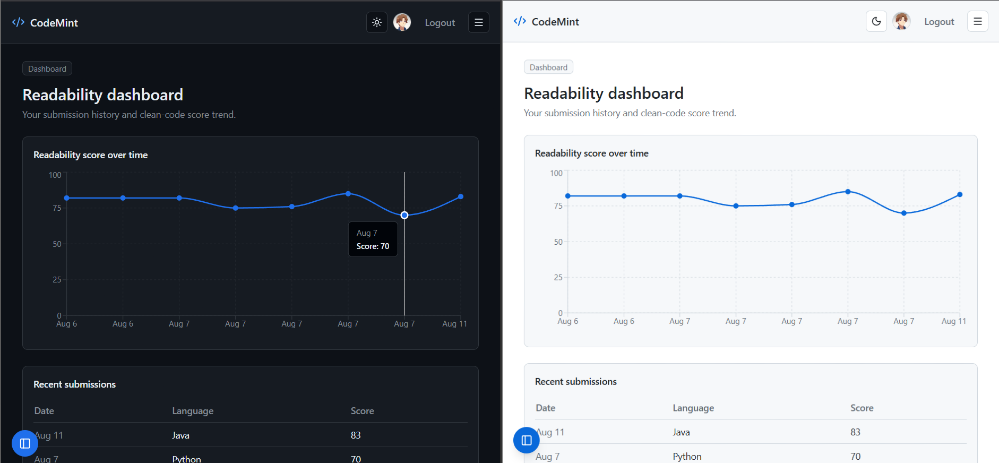
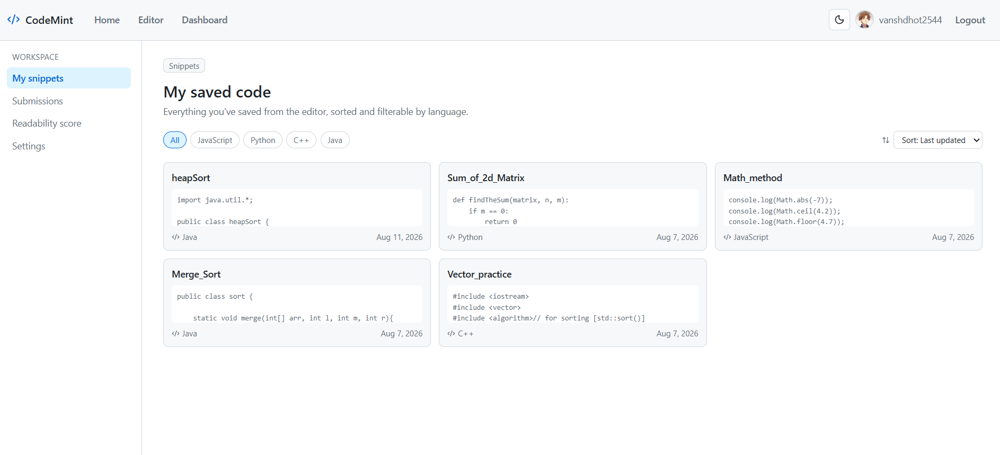

<p align="center">
  
</p>

<h1 align="center">🍃 CodeMint</h1>

<p align="center">
  <strong>Write cleaner code, one submission at a time.</strong><br/>
  An in-browser code editor with instant execution, test-case validation, and AI-powered readability feedback.
</p>

<p align="center">
  
  
  
  
  
  
</p>

---

## 📸 Screenshots

### Code Editor
> Monaco-powered editor with multi-language support, Run & Submit actions, and a side panel for output, test cases, and AI suggestions.



### Readability Dashboard
> Track your clean-code score over time with interactive charts and a history of recent submissions.



### Saved Snippets
> Browse, filter, and manage all your saved code snippets — organized by language with quick-edit access.



---

## ✨ Features

| Feature | Description |
|---------|-------------|
| **🖥️ Monaco Editor** | Full-featured code editor (same engine as VS Code) with syntax highlighting and IntelliSense |
| **🌐 Multi-Language** | JavaScript, Python, Java, and C++ — each with starter templates |
| **⚡ Instant Execution** | Run code in the browser via a self-hosted [Piston](https://github.com/engineer-man/piston) engine |
| **🧪 Test Cases** | Define custom input/output test cases and see pass/fail results per case |
| **🤖 AI Feedback** | Gemini-powered readability analysis with a 0–100 score and actionable suggestions |
| **📊 Static Analysis** | ESLint (JS) and Pylint (Python) findings fed into AI context for richer feedback |
| **📈 Score Tracking** | Interactive Recharts dashboard showing your readability trend over time |
| **💾 Snippets Library** | Save, update, filter, and sort your code snippets — persisted in MongoDB |
| **📋 Submission History** | Full log of every run/submit with code, output, test results, and suggestions |
| **🌓 Theme Toggle** | GitHub Light / Dark theme toggle across the entire app |
| **🔐 Auth** | JWT-based authentication with Google OAuth integration |

---

## 🏗️ Tech Stack

### Frontend
| Technology | Purpose |
|------------|---------|
| [React 19](https://react.dev/) | UI framework |
| [Vite 8](https://vite.dev/) | Build tool & dev server |
| [Tailwind CSS 3](https://tailwindcss.com/) | Utility-first styling |
| [Monaco Editor](https://microsoft.github.io/monaco-editor/) | Code editor component |
| [Recharts](https://recharts.org/) | Dashboard charts |
| [Lucide React](https://lucide.dev/) | Icon library |
| [React Router 7](https://reactrouter.com/) | Client-side routing |

### Backend
| Technology | Purpose |
|------------|---------|
| [Node.js](https://nodejs.org/) + [Express 5](https://expressjs.com/) | REST API server |
| [MongoDB Atlas](https://www.mongodb.com/atlas) + [Mongoose 9](https://mongoosejs.com/) | Database & ODM |
| [Piston](https://github.com/engineer-man/piston) | Sandboxed code execution (Docker) |
| [Gemini AI](https://ai.google.dev/) | Readability scoring & suggestions |
| [ESLint](https://eslint.org/) / [Pylint](https://pylint.org/) | Static code analysis |
| [JWT](https://jwt.io/) + [Google OAuth](https://developers.google.com/identity) | Authentication |

---

## 📁 Project Structure

```
CodeMint/
├── client/                     # React frontend (Vite)
│   ├── src/
│   │   ├── components/         # Navbar, Sidebar, AuthModal
│   │   ├── context/            # ThemeContext, AuthContext
│   │   ├── data/               # Language definitions
│   │   ├── pages/              # Home, Editor, Dashboard, Snippets, Submissions, Login
│   │   ├── App.jsx             # Root component with routing
│   │   └── main.jsx            # Entry point
│   ├── index.html
│   ├── tailwind.config.js
│   └── package.json
│
├── server/                     # Express backend
│   ├── config/                 # Database connection
│   ├── middleware/              # Auth middleware
│   ├── models/                 # User, Snippet, Submission (Mongoose)
│   ├── routes/                 # auth, execute, snippets, submissions
│   ├── services/               # AI feedback (Gemini)
│   ├── utils/                  # Helper utilities
│   ├── index.js                # Server entry point
│   └── package.json
│
├── screenshots/                # App screenshots for README
├── LICENSE                     # MIT License
└── README.md
```

---

## 🚀 Getting Started

### Prerequisites

- **Node.js** ≥ 18
- **npm** ≥ 9
- **MongoDB Atlas** account (or a local MongoDB instance)
- **Docker** (for Piston code execution engine)
- **Google Cloud** project with OAuth 2.0 credentials
- **Gemini API** key from [Google AI Studio](https://aistudio.google.com/)

### 1. Clone the repository

```bash
git clone https://github.com/VanshSingh7/CodeMint.git
cd CodeMint
```

### 2. Set up environment variables

**Server** (`server/.env`):
```env
PORT=5000
CLIENT_URL=http://localhost:5173
MONGO_URI=mongodb+srv://<user>:<password>@<cluster>.mongodb.net/codemint
JWT_SECRET=your_jwt_secret
GOOGLE_CLIENT_ID=your_google_client_id
GEMINI_API_KEY=your_gemini_api_key
PISTON_URL=http://localhost:2000
```

**Client** (`client/.env`):
```env
VITE_API_URL=http://localhost:5000/api
```

### 3. Install dependencies

```bash
# Install server dependencies
cd server
npm install

# Install client dependencies
cd ../client
npm install
```

### 4. Start the Piston engine

```bash
docker run -d --name piston -p 2000:2000 ghcr.io/engineer-man/piston
```

### 5. Run the development servers

```bash
# Terminal 1 — Backend
cd server
npm run dev

# Terminal 2 — Frontend
cd client
npm run dev
```

The app will be available at **http://localhost:5173**

---

## 🔌 API Endpoints

| Method | Endpoint | Description | Auth |
|--------|----------|-------------|------|
| `POST` | `/api/auth/register` | Register a new user | ❌ |
| `POST` | `/api/auth/login` | Login with email/password | ❌ |
| `POST` | `/api/auth/google` | Login with Google OAuth | ❌ |
| `POST` | `/api/execute` | Execute code via Piston | ✅ |
| `GET` | `/api/snippets/mine` | Get user's saved snippets | ✅ |
| `GET` | `/api/snippets/:id` | Get a single snippet | ✅ |
| `POST` | `/api/snippets` | Create a new snippet | ✅ |
| `PUT` | `/api/snippets/:id` | Update a snippet | ✅ |
| `DELETE` | `/api/snippets/:id` | Delete a snippet | ✅ |
| `GET` | `/api/submissions/mine` | Get user's submissions | ✅ |
| `POST` | `/api/submissions` | Create a submission (triggers AI feedback) | ✅ |
| `GET` | `/api/submissions/readability-trend` | Get readability score trend | ✅ |
| `GET` | `/api/health` | Health check | ❌ |

---

## 🔄 How It Works

```
┌─────────────────────────────────────────────────────────┐
│                     BROWSER (Client)                     │
│                                                          │
│  ┌──────────┐  ┌───────────┐  ┌───────────┐  ┌───────┐ │
│  │  Monaco   │  │ Dashboard │  │ Snippets  │  │ Auth  │ │
│  │  Editor   │  │  Charts   │  │  Library  │  │ Modal │ │
│  └────┬─────┘  └─────┬─────┘  └─────┬─────┘  └───┬───┘ │
│       │              │              │             │      │
└───────┼──────────────┼──────────────┼─────────────┼──────┘
        │              │              │             │
        ▼              ▼              ▼             ▼
┌─────────────────────────────────────────────────────────┐
│                  EXPRESS API SERVER                       │
│                                                          │
│  ┌──────────┐  ┌───────────┐  ┌─────────┐  ┌─────────┐ │
│  │ /execute  │  │/submissions│ │/snippets│  │  /auth  │ │
│  └────┬─────┘  └─────┬─────┘  └────┬────┘  └────┬────┘ │
│       │              │             │             │      │
│       │         ┌────┴────┐        │        ┌────┴────┐ │
│       │         │ ESLint/ │        │        │   JWT   │ │
│       │         │ Pylint  │        │        │  Google │ │
│       │         └────┬────┘        │        │  OAuth  │ │
│       │              │             │        └─────────┘ │
│       │         ┌────┴────┐        │                    │
│       │         │ Gemini  │        │                    │
│       │         │   AI    │        │                    │
│       │         └─────────┘        │                    │
└───────┼──────────────────────────┬─┼────────────────────┘
        │                          │ │
        ▼                          ▼ ▼
┌──────────────┐          ┌──────────────────┐
│    Piston    │          │  MongoDB Atlas   │
│   (Docker)   │          │                  │
│  Sandboxed   │          │  Users           │
│  Execution   │          │  Snippets        │
│              │          │  Submissions     │
└──────────────┘          └──────────────────┘
```

---

## 🧑‍💻 Supported Languages

| Language | Version | Static Analysis |
|----------|---------|-----------------|
| Java | 15.0.2 | — |
| JavaScript | 18.15.0 | ESLint |
| Python | 3.10.0 | Pylint |
| C++ | 10.2.0 | — |

---

## 🤝 Contributing

Contributions are welcome! Here's how to get started:

1. **Fork** the repository
2. **Create** a feature branch: `git checkout -b feature/amazing-feature`
3. **Commit** your changes: `git commit -m 'Add amazing feature'`
4. **Push** to the branch: `git push origin feature/amazing-feature`
5. **Open** a Pull Request

---

## 📝 License

This project is licensed under the **MIT License** — see the [LICENSE](LICENSE) file for details.

---

## 👤 Author

**Vanshdeep Singh Dhot**

---

<p align="center">
  <sub>Built with 💚 for learners who want to write better code.</sub>
</p>